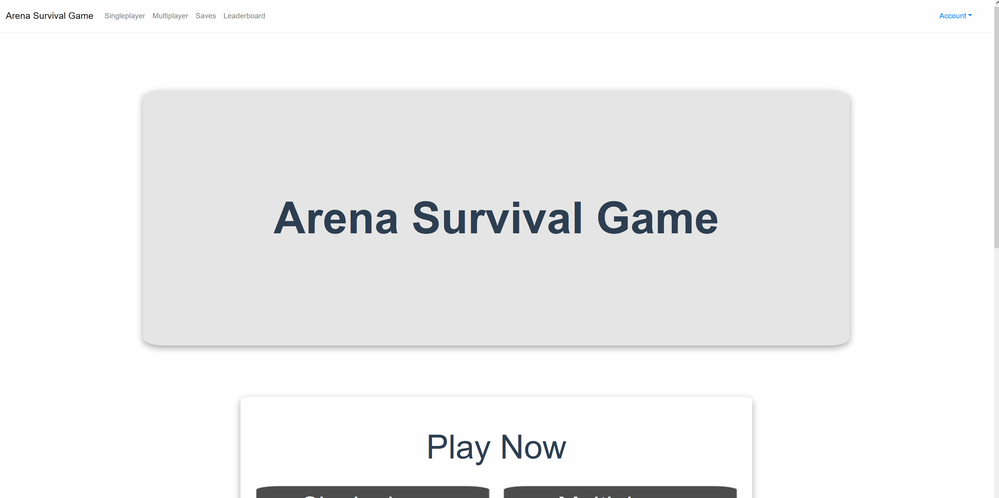
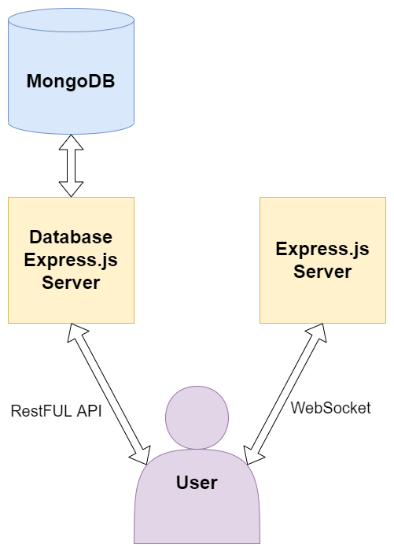

# **Arena Survival Game**

## **Table of Contents**

### **This README**

| Name | Description | Link |
| - | - | - |
| Quick Start | Set up the project quickly | [Click me](#quick-start) |
| Demonstration | Shows how the project runs | [Click me](#demonstration) |
| Architecture | A WebSocket implemented using Socket.io | [Click me](#architecture) |

---

### **Other Directories**

| Name | Description | Link |
| - | - | - |
| Frontend | Frontend implemented using Vue.js | [Click me](./frontend/) |
| Database | Backend that connects with MongoDB | [Click me](./database/) |
| WebSocket | A WebSocket implemented using Socket.io | [Click me](./websocket/) |

<br>

## **Quick Start**

Steps:

- Ensure that [MongoDB](https://www.mongodb.com/) is installed
- Add a `.env` file with in the [MongoDB directory](./database/) with a `REFRESH_SECRET` and `ACCESS_SECRET`
  
  ```bash
  REFRESH_SECRET=REPLACE_THIS_WITH_SECRET
  ACCESS_SECRET=REPLACE_THIS_WITH_SECRET
  ```

- Run `npm run first-install` in this directory
- Run `npm run serve` in this directory

<br>

## **Demonstration**

### **Sample Gameplay**


---

### **Creating an Account, Logging in, Logging out**



<br>

## **Architecture**


